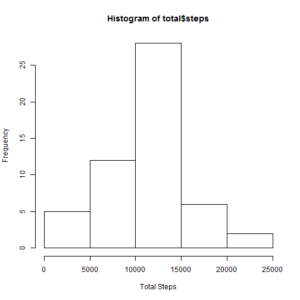
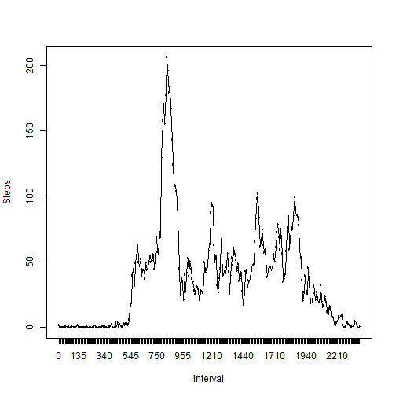
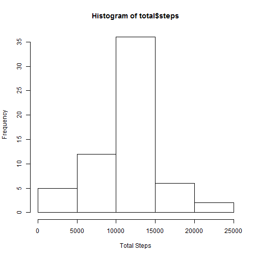
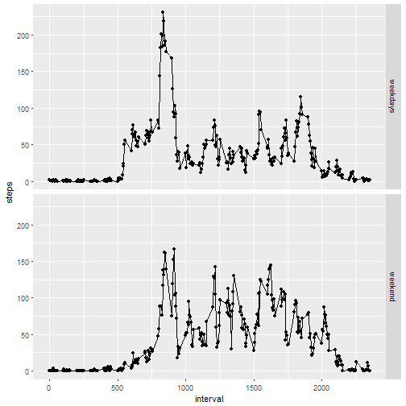

---
title: "Peer1"
output:
  md_document: default
  html_document: default
  pdf_document: default
---


# Peer assignment 1


```r
setwd("C:/Users/janice-pc/Documents/JP/June/Cousera")
data<- read.csv("activity.csv")
```

##1. What is mean total number of steps taken per day? 
###1.1 Calculate the total number of steps taken per day
###1.2 If you do not understand the difference between a histogram and a barplot, research the difference between them. Make a histogram of the total number of steps taken each day
###1.3 Calculate and report the mean and median of the total number of steps taken per day

```r
act<- data[complete.cases(data),]
total<- aggregate(act$steps,by=list(act$date),FUN=sum)
colnames(total)<- c("date", "steps")
hist(total$steps, xlab="Total Steps")
```



```r
summary(total$steps)
```

```
##    Min. 1st Qu.  Median    Mean 3rd Qu.    Max. 
##      41    8841   10765   10766   13294   21194
```

##2. Average activity pattern 
###2.1 Make a time series plot (i.e. type = "l") of the 5-minute interval (x-axis) and the average number of steps taken, averaged across all days (y-axis)
###2.2 Which 5-minute interval, on average across all the days in the dataset, contains the maximum number of steps?

```r
act<- data[complete.cases(data),]
act$interval<- as.factor(act$interval)
daily<- aggregate(act$steps,by=list(act$interval),FUN=mean)
colnames(daily)<- c("interval", "steps")
plot(daily$interval, daily$steps,type='l',xlab="Interval",ylab="Steps")
lines(daily$interval, daily$steps)
```



```r
index<- which.max(daily$steps)
daily[index,]
```

```
##     interval    steps
## 104      835 206.1698
```

##3.Impute NA 
###3.1 Fill in NA data with mean for that 5-minute interval 
### 3.2 Make a histogram of the total number of steps taken each day and Calculate and report the mean and median total number of steps taken per day

```r
sum(is.na(data$steps))
```

```
## [1] 2304
```

```r
for (i in 1:nrow(data)) {
if (is.na(data$steps[i])== TRUE) { 
 
#find the average steps in that interval
 NAint<- data[i,3]
 row<- which(daily$interval == NAint)

#replace NA
 NAreplace<- daily$steps[row]
 data$steps[i]<- NAreplace
 }}

total<- aggregate(data$steps,by=list(data$date),FUN=sum)
colnames(total)<- c("date", "steps")
hist(total$steps, xlab="Total Steps")
```



```r
summary(total$steps)
```

```
##    Min. 1st Qu.  Median    Mean 3rd Qu.    Max. 
##      41    9819   10766   10766   12811   21194
```

##4.Weekdays compare
### 4.1 Create a new factor variable in the dataset with two levels – “weekday” and “weekend” indicating whether a given date is a weekday or weekend day.
### 4.2 Make a panel plot containing a time series plot (i.e. type = "l") of the 5-minute interval (x-axis) and the average number of steps taken, averaged across all weekday days or weekend days (y-axis)

```r
data$date<- as.Date(as.character(data$date), format="%Y-%m-%d")
data$type<- weekdays(data$date)
data$type[data$type %in% c('Saturday','Sunday')]<- "weekend"
data$type[data$type != "weekend"]<- "weekdays"
data$type<- as.factor(data$type)
week<- aggregate(data$steps,by=list(data$interval, data$type),mean)
colnames(week)<- c("interval","type","steps")
library(ggplot2)
```

```
## Find out what's changed in ggplot2 at
## http://github.com/tidyverse/ggplot2/releases.
```

```r
qplot(interval, steps, data=week,facets=type~.) +geom_line()
```




